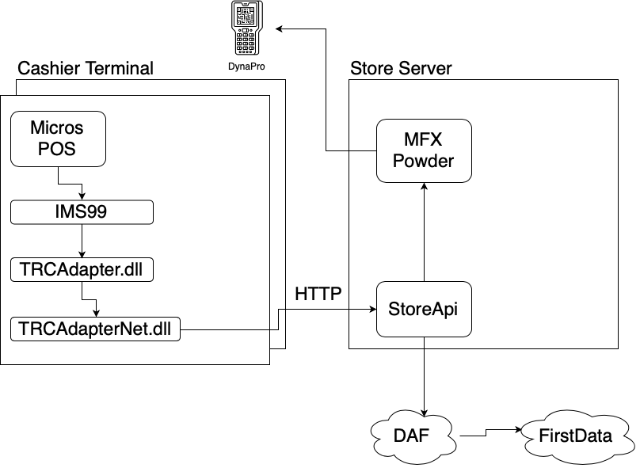
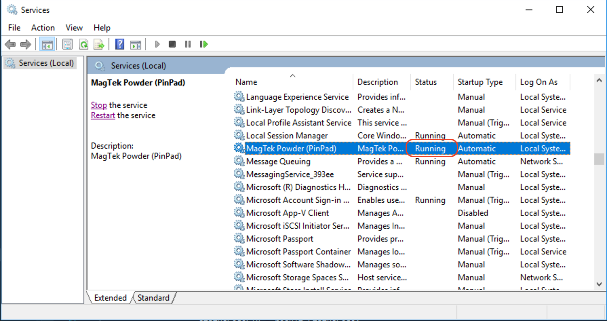
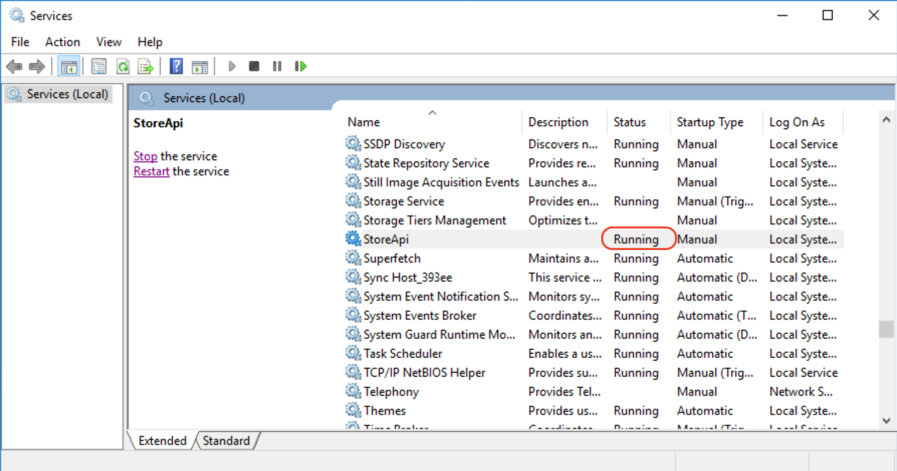

# Store Api Troubleshooting Guide

## Store Env Overview

### Connection


### Micros StoreApi Flow



## Configurations

### Cashier Machine

Every cashier PC should be pointed and be able to connect to Store Api. StoreApi url can be configured in Machine.config.

Machine.config path:

    (x64) C:\Windows\Microsoft.NET\Framework64\v4.0.30319\Config
    (x86) C:\Windows\Microsoft.NET\Framework\v4.0.30319\Config

``` xml
...
    <appSettings>
        ...
        <add name="StoreApiUrl" value="http://10.20.61.2:5000" />
        ...
    </appSettings>
...
```

StoreApiUrl value used by TRCAdapterNet.Dll to make request to Store Api (hosted at Store Server).

StoreApiUrl Mask 'http://10.2X.XX.2:5000` where X.XX is number of current store.

Examples:
| StoreId | Url                    |
| ------- | ---------------------- |
| 061     | http://10.20.61.2:5000 |
| 106     | http://10.21.06.2:5000 |
| 251     | http://10.22.51.2:5000 |

> You can check connectivity with StoreApi by opening in browser (from Cashier Machine) url: `http://10.2X.XX.2:5000/swagger`. You should be able to see swagger page.

### Server

On server should be runned nest services:




> Use Stop/Start/Restart button to control services.  

StoreApi should listen port 5000. You can change port in `hosting.json` file.

```json
{
  "urls": "http://*:5000"
}
```

> Try open url: `http://localhost:5000/swagger` to make sure that StoreApi is running.
