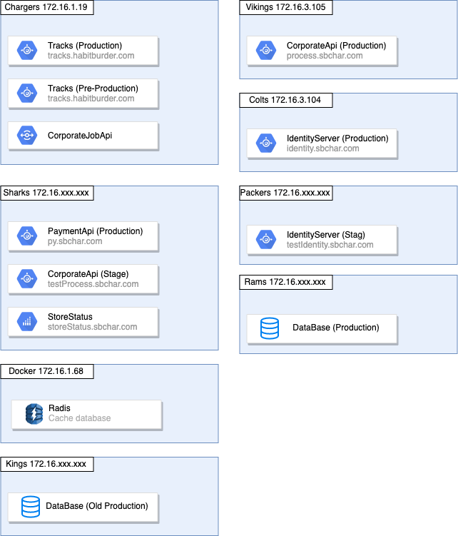
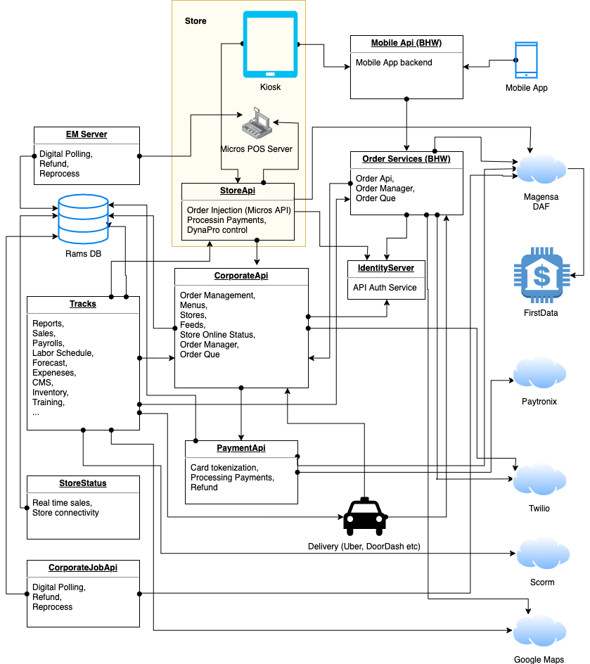

# Habit IT Structure

## Network

### Servers

1. RAMS (IP:`172.16.1.19`)
2. Chargers (IP:`172.16.1.19`)
3. Vikings (IP:`172.16.1.19`)
4. Colts (IP:`172.16.1.19`)
5. Packers (IP:`172.16.1.19`)
6. Sharks (IP:`172.16.1.19`)
7. Docker (IP:`172.16.1.19`)
8. Kings (IP:`172.16.1.19`)

## Applications/Apis

1. 

